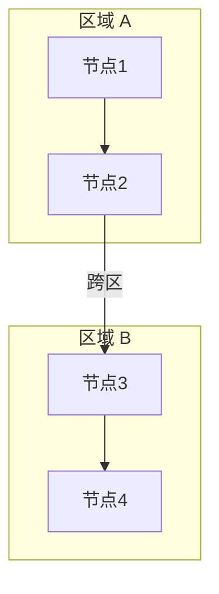

# 交互式技术文档生成

## 输出规则

每次都生成（或更新）：
- `docs/系统架构文档.html` — 浏览器打开，多 tab 交互式文档

可选（仅当项目涉及 PLC 通信时）：
- `docs/PLC接口对接文档.html` — PLC 程序员专用，信号映射 + 操作时序

不需要生成 .md 版本（HTML 已满足所有需求）

---

## HTML 骨架模板（权威版本）

以下为经验证可工作的 HTML 骨架。**关键点用 ★ 标注，修改时不得偏离。**

```html
<!DOCTYPE html>
<html lang="zh-CN">
<head>
<meta charset="UTF-8">
<meta name="viewport" content="width=device-width, initial-scale=1.0">
<title>{{TITLE}}</title>
<script src="https://cdn.jsdelivr.net/npm/mermaid@10/dist/mermaid.min.js"></script>
<script src="https://cdn.jsdelivr.net/npm/katex@0.16/dist/katex.min.js"></script>
<script src="https://cdn.jsdelivr.net/npm/katex@0.16/dist/contrib/auto-render.min.js"></script>
<link rel="stylesheet" href="https://cdn.jsdelivr.net/npm/katex@0.16/dist/katex.min.css">
<style>
:root{--bg:#1a1a2e;--panel:#16213e;--accent:#0f3460;--hl:#e94560;--text:#eee;--muted:#a0a0b0;--border:#2a2a4a;--green:#00c853;--orange:#ff9100;--blue:#448aff;--purple:#bb86fc}
*{box-sizing:border-box;margin:0;padding:0}
body{font-family:'Segoe UI',system-ui,-apple-system,sans-serif;background:var(--bg);color:var(--text);line-height:1.7}
header{background:linear-gradient(135deg,#16213e,#0f3460);padding:48px 24px 48px 204px;text-align:center;border-bottom:3px solid var(--hl)}
header h1{font-size:2em;margin-bottom:8px}
header p{color:var(--muted);font-size:1.1em}
nav{position:fixed;left:0;top:0;width:180px;height:100vh;display:flex;flex-direction:column;gap:2px;padding:80px 8px 16px;background:var(--panel);border-right:1px solid var(--border);z-index:100;overflow-y:auto}
nav button{padding:10px 12px;border:1px solid var(--border);background:transparent;color:var(--muted);border-radius:8px;cursor:pointer;font-size:.88em;transition:all .2s;text-align:left;width:100%}
nav button:hover,nav button.active{background:var(--accent);color:#fff;border-color:var(--hl)}
main{max-width:1200px;margin-left:196px;margin-right:auto;padding:32px 24px}
section{display:none;animation:fade .3s}
section.active{display:block}
@keyframes fade{from{opacity:0;transform:translateY(8px)}to{opacity:1;transform:translateY(0)}}
/* ★ Mermaid 图必须白色背景 */
.mermaid{background:#fff;border-radius:12px;padding:24px;margin:24px 0;text-align:center;overflow-x:auto}
h2{font-size:1.5em;margin:32px 0 16px;padding-bottom:8px;border-bottom:2px solid var(--border)}
h3{font-size:1.15em;margin:24px 0 12px;color:var(--blue)}
table{width:100%;border-collapse:collapse;margin:16px 0;font-size:.95em}
th,td{padding:10px 14px;text-align:left;border-bottom:1px solid var(--border)}
th{background:var(--accent);color:#fff;font-weight:600}
tr:hover{background:rgba(255,255,255,.04)}
details{background:var(--panel);border:1px solid var(--border);border-radius:8px;padding:12px 16px;margin:12px 0}
details summary{cursor:pointer;font-weight:600;color:var(--blue);padding:4px 0}
.card-grid{display:grid;grid-template-columns:repeat(auto-fit,minmax(280px,1fr));gap:16px;margin:20px 0}
.card{background:var(--panel);border:1px solid var(--border);border-radius:10px;padding:20px}
.card h4{margin-bottom:8px;color:var(--blue)}
.badge{display:inline-block;padding:3px 10px;border-radius:12px;font-size:.8em;font-weight:600}
.badge-done{background:#00c85333;color:var(--green)}
.badge-todo{background:#ff910033;color:var(--orange)}
.badge-info{background:#448aff33;color:var(--blue)}
footer{text-align:center;padding:32px;color:var(--muted);font-size:.85em;border-top:1px solid var(--border)}
.col2{display:grid;grid-template-columns:1fr 1fr;gap:16px}@media(max-width:768px){.col2{grid-template-columns:1fr}}
/* ★ PNG fallback 默认隐藏，由 JS 按需显示 */
.mermaid-fallback{display:none}
@media(max-width:768px){nav{position:relative;width:100%;height:auto;flex-direction:row;flex-wrap:wrap;padding:12px 8px}nav button{width:auto;font-size:.78em}main{margin-left:0}header{padding-left:24px}footer{padding-left:32px}}
</style>
</head>
<body>
<header><h1>{{TITLE}}</h1><p>{{SUBTITLE}}</p></header>
<nav>
  <button class="active" onclick="showTab('overview',event)">架构总览</button>
  <button onclick="showTab('timeline',event)">启动时序</button>
  <button onclick="showTab('dataflow',event)">数据流</button>
  <button onclick="showTab('modules',event)">调用关系</button>
  <button onclick="showTab('algorithms',event)">算法公式</button>
  <button onclick="showTab('functions',event)">关键函数</button>
  <button onclick="showTab('glossary',event)">关键名词</button>
</nav>
<main>
{{SECTIONS}}
</main>
<footer>{{FOOTER}}</footer>

<!-- ★ 脚本：渲染和 tab 切换 — 不得偏离以下模式 -->
<script>
// ★ 1. 初始化：startOnLoad 必须为 false
mermaid.initialize({
  startOnLoad: false,
  theme: 'neutral',
  securityLevel: 'loose',
  suppressErrorRendering: true,
  sequence: { noteMargin: 30, messageMargin: 50 }
});

// ★ 2. KaTeX 渲染
renderMathInElement(document.body,{
  delimiters:[{left:'$$',right:'$$',display:true}],
  throwOnError:false
});

// ★ 3. 页面加载后只渲染首个可见 tab
(async function(){
  await mermaid.run({ querySelector: '#overview .mermaid' });
  checkFallbacks('overview');
})();

// ★ 3b. mermaid 渲染完成后检查是否需要显示 PNG fallback
function checkFallbacks(sectionId) {
  var container = document.getElementById(sectionId);
  if (!container) return;
  var diagrams = container.querySelectorAll('.mermaid');
  var fallbacks = container.querySelectorAll('.mermaid-fallback');
  fallbacks.forEach(function(img, i) {
    var mermaidDiv = diagrams[i];
    if (!mermaidDiv || !mermaidDiv.querySelector('svg')) {
      img.style.display = 'block';
    }
  });
}

// ★ 4. Tab 切换 — 核心逻辑
function showTab(id, e) {
  // 切换 section 显隐
  document.querySelectorAll('section').forEach(function(s){s.classList.remove('active')});
  document.getElementById(id).classList.add('active');
  // 高亮按钮：优先用传入的 event，fallback 用 querySelector
  document.querySelectorAll('nav button').forEach(function(b){b.classList.remove('active')});
  if (e && e.target) { e.target.classList.add('active'); }
  else {
    var btn = document.querySelector('nav button[onclick*="showTab(\''+id+'\'"]');
    if (btn) btn.classList.add('active');
  }
  // ★ 重渲染 mermaid 图（reset data-processed 允许重新渲染）
  var container = document.getElementById(id);
  if (container) {
    var diagrams = container.querySelectorAll('.mermaid');
    if (diagrams.length > 0) {
      diagrams.forEach(function(d) {
        if (!d.querySelector('svg')) { d.removeAttribute('data-processed'); }
      });
      mermaid.run({ querySelector: '#' + id + ' .mermaid' }).then(function() {
        checkFallbacks(id);
      });
    }
  }
}
</script>
</body>
</html>
```

---

## Mermaid 渲染关键规则（经验证）

### 初始化三要素

| 设置 | 值 | 原因 |
|------|-----|------|
| `startOnLoad` | **`false`** | 隐藏 tab 的 mermaid 容器尺寸为 0，自动渲染必然失败 |
| 首 tab 渲染 | `await mermaid.run({ querySelector: '#overview .mermaid' })` | 页面加载后手动渲染仅可见 tab |
| `suppressErrorRendering` | **`true`** | 避免渲染错误时 mermaid 注入红色错误框破坏布局 |

### Tab 切换渲染

每次切 tab 必须重新 `mermaid.run()`，因为之前该 tab 是 `display:none`，尺寸为 0，首次渲染结果为空。

渲染前必须检查并清除 `data-processed` 属性：
```javascript
diagrams.forEach(function(d) {
  if (!d.querySelector('svg')) { d.removeAttribute('data-processed'); }
});
mermaid.run({ querySelector: '#' + id + ' .mermaid' });
```

> **原理**：mermaid 渲染完成后会给 div 加 `data-processed="true"` 属性。再次调用 `mermaid.run()` 时会跳过已处理的 div。但隐藏 tab 中的 div 虽被标记为 processed，实际渲染内容为空（因为没有尺寸）。所以必须手动清除该属性。

### 语法限制（已验证）

| 写法 | 是否可用 | 说明 |
|------|---------|------|
| `<br/>` 换行 | ✅ 可用 | mermaid 10 支持节点内 HTML 换行 |
| 中文 `（）` | ✅ 可用 | 全角括号不干扰解析 |
| 英文 `()` 在节点标签中 | ❌ 避免 | 如 `send(data, 80)` 会导致解析中断 |
| `*` 开头的标签文本 | ❌ 避免 | 如 `*iops = GOOD` 可能被误解析 |
| `%` 符号 | ⚠️ 谨慎 | 在非引号区域表示注释 |
| 跨 subgraph 边 | ❌ 不可用 | 如 `subgraph A` 中的节点 `-->` `subgraph B` 中的节点 |
| `graph TB` / `graph TD` | ⚠️ 弃用 | 统一用 `flowchart TB` / `flowchart TD` |

### 子图使用规范



> **禁止**写 `A --> B` 或 `N1 --> N4` 且 N1/N4 在不同子图中。mermaid 无法可靠处理跨子图节点引用。

### Python 字符串转义陷阱（重要！）

用 Python 脚本生成 HTML 时，LaTeX 反斜杠命令会被 Python 当作转义序列吃掉：

| LaTeX 命令 | Python 普通字符串中 | 写入文件后 | 正确做法 |
|-----------|-------------------|-----------|---------|
| `\text{...}` | `\t` → TAB (0x09) | `{...}` | 用原始字符串 `r"\text{...}"` |
| `\begin{...}` | `\b` → BS (0x08) | `egin{...}` | `r"\begin{...}"` |
| `\neg` | `\n` → NL (0x0a) | `eg` | `r"\neg"` |
| `\\`（换行） | `\\` → 单 `\` | `\ ` | `r"\\"`  或 `\\\\` |

> **规则**：生成 HTML 时，所有包含 LaTeX 的 Python 字符串必须用 `r"..."` 原始字符串，或在每个 `\` 前再加一个 `\`（`\\text`、`\\begin`）。

---

## 架构总览 Tab（必须）

**在 Mermaid 图之前，必须有一段文字总体描述**（2~3 段），说清楚三件事：
1. 系统定位（是什么、运行在哪里、连接什么）
2. 数据流转（从哪到哪、经过哪些组件、用什么协议）
3. 关键设计（透传还是解析、同步还是异步、有什么取舍）

---

## 模式 1：启动时序（双图组合）

**必须同时包含两图**：mermaid sequenceDiagram（消息交互总览）+ 交互式时间轴（可点击详情）。

### 组合结构

```html
<section id="timing">
<h2>启动与运行时序</h2>

<!-- ① Mermaid 时序总览：展示谁给谁发什么消息 -->
<div class="mermaid">
sequenceDiagram
    participant Robot as 运动控制器
    participant pn_dev
    participant PLC
    Note over Robot: t=0s
    Robot->>Robot: 启动
    Note over pn_dev: t=6s
    pn_dev->>Robot: TCP connect
    ...
</div>


<!-- ② 交互式时间轴：可点击查看各时刻详情 -->
<h3>交互式时间轴</h3>
<div class="tl-axis">...</div>
<!-- ③ 事件总览表：一次性展示所有时刻 -->
<h3>事件总览</h3>
<table>...</table>
```

### 交互式时间轴：数据结构

```javascript
const timelineEvents = {
  T0: { title:'时间点名称', participants:[
    {name:'参与者A', status:'正在做的事'},
    {name:'',         status:'同一参与者的第二件事（name为空则同行）'},
    {name:'参与者B', status:'另一参与者的状态'},
  ]},
  T1: { /* ... */ },
};
```

### HTML 模板

```html
<section id="timeline">
<h2>{{章节标题}}</h2>
<p style="color:var(--muted)">点击圆形标记或下方按钮，查看各时间点的详细状态</p>

<div class="tl-axis"><div class="tl-track"></div>
{{TIMELINE_MARKERS}}
{{TIMELINE_LABELS}}
</div>

<div class="tl-lanes">
  <div class="tl-lane-label">Robot</div>
  <div class="tl-lane">{{ROBOT_EVENTS}}</div>
  <div class="tl-lane-label">pn_dev</div>
  <div class="tl-lane">{{PN_EVENTS}}</div>
  <div class="tl-lane-label">PLC</div>
  <div class="tl-lane">{{PLC_EVENTS}}</div>
</div>

<div class="tl-btns">{{TIMELINE_BUTTONS}}</div>
<div class="tl-detail" id="tlDetail"><h4>点击按钮查看详情</h4></div>
</section>
```

### 必须的 CSS

```css
.tl-axis{position:relative;height:70px;background:var(--panel);border-radius:8px;margin:16px 0 4px;overflow:visible}
.tl-track{position:absolute;top:34px;left:40px;right:40px;height:4px;background:var(--border);border-radius:2px}
.tl-marker{position:absolute;top:24px;width:16px;height:16px;border-radius:50%;background:var(--blue);border:3px solid var(--bg);cursor:pointer;z-index:2;transition:.2s}
.tl-marker:hover{transform:scale(1.5);background:var(--hl)}
.tl-marker.active{background:var(--hl);box-shadow:0 0 14px var(--hl);width:20px;height:20px;top:22px}
.tl-mlabel{position:absolute;top:0;font-size:.7em;color:var(--muted);white-space:nowrap;transform:translateX(-50%)}
.tl-lanes{display:grid;grid-template-columns:70px 1fr;gap:4px;margin:6px 0}
.tl-lane-label{font-size:.75em;color:var(--blue);font-weight:600;padding:4px 0}
.tl-lane{position:relative;height:34px;background:var(--panel);border-radius:6px;overflow:visible}
.tl-ev{position:absolute;top:5px;height:24px;border-radius:4px;font-size:.65em;padding:3px 6px;white-space:nowrap;overflow:hidden;cursor:pointer}
.tl-ev:hover{filter:brightness(1.3);z-index:5}
.ev-robot{background:var(--blue)}.ev-pn{background:#bb86fc}.ev-plc{background:var(--orange)}
.tl-ev.active{outline:2px solid #fff;z-index:6}
.tl-btns{display:flex;gap:6px;flex-wrap:wrap;margin:12px 0}
.tl-btn{padding:6px 14px;border:1px solid var(--border);background:var(--panel);color:var(--text);border-radius:16px;cursor:pointer;transition:.2s;font-size:.82em}
.tl-btn:hover,.tl-btn.active{background:var(--accent);border-color:var(--hl)}
.tl-detail{padding:16px;background:var(--panel);border-radius:10px;border:1px solid var(--border);min-height:60px}
.tl-detail h4{color:var(--hl);margin-bottom:8px}
.tl-detail ul{margin-left:16px;line-height:1.8}
```

### 交互 JS

```javascript
function showTL(t){
  document.querySelectorAll('.tl-btn,.tl-marker,.tl-ev').forEach(function(e){e.classList.remove('active')});
  document.querySelectorAll('.tl-btn[data-tl="'+t+'"]').forEach(function(b){b.classList.add('active')});
  document.querySelectorAll('.tl-marker[data-t="'+t+'"]').forEach(function(m){m.classList.add('active')});
  document.querySelectorAll('.tl-ev[data-t="'+t+'"]').forEach(function(e){e.classList.add('active')});
  var d=TL[t]; if(!d) return;
  var h='<h4>'+d.title+'</h4>';
  d.participants.forEach(function(x){
    h+=x.name
      ?('<p style="margin-top:8px"><strong style="color:var(--blue)">'+x.name+'</strong></p><ul><li>'+x.status+'</li></ul>')
      :('<ul><li>'+x.status+'</li></ul>');
  });
  document.getElementById('tlDetail').innerHTML=h;
}
```

### 生成规则

- 两图缺一不可：sequenceDiagram 展示消息交互 → 交互式时间轴展示时段分布 → 事件总览表一屏看完
- 每个时间点一个 `<div class="tl-marker" data-t="T键" style="left:X%">`
- left% = 时间点 / 总时长 × 100，预留 3%~96% 边距
- 泳道 event 颜色：Robot=`ev-robot`(蓝) / pn_dev=`ev-pn`(紫) / PLC=`ev-plc`(橙)
- 按钮用 `data-tl="T键"` 与 marker 的 `data-t` 对应
- TL 数据中增加 `{n:'消息', s:'A → B: 协议/数据'}` 条目，用 Unicode 箭头标注通信方向
- 事件总览表包含「关键消息」列，用颜色标注方向
- 页面加载后调用 `showTL(第一个时间点)` 显示初始详情

---

## 模式 2：数据流详解（三层结构）

数据流是读者真正理解代码的入口。必须按三层展开：

### 三层结构（必须遵守）

**3.1 整体数据流 → 3.2 关键函数详解 → 3.3 框架内部数据流**

### 3.1 整体数据流

包含：
- **Mermaid flowchart** — 端到端数据路径（1 张图覆盖从 tick 到帧发出的完整链路）
- **逐步走读表** — 每一步的「位置 + 线程 + 动作」，让读者对着图 trace 代码
- **时序特征表** — 关键周期参数（PROFINET 1ms、应用轮询 100ms、TCP 同步阻塞）

```html
<div class="card">
<h4>逐步走读（一次完整的周期）</h4>
<table>
<tr><th>步骤</th><th>位置</th><th>线程</th><th>动作</th></tr>
<tr><td>① 帧到达</td><td>pf_eth.c</td><td>ETH RX</td><td>网卡收到帧 → FrameID 路由到 pf_cpm_c_data_ind()</td></tr>
...
</table>
</div>
```

### 3.2 关键函数详解

每个关键函数一个可折叠的 `<div class="algo">` 块（复用算法公式的折叠样式），包含：
- **签名与位置**：函数名 + 文件:行号 + 返回值 + 线程上下文
- **输入/输出**：表格列出每个参数的含义
- **逻辑**：有序列表逐步描述函数做了什么
- **调用链**（可选）：谁调它、它调谁

必须覆盖的函数：
1. `app_cyclic_data_callback()` — 周期回调调度器
2. `app_data_set_output_data()` — PLC→Robot 转发
3. `app_data_get_input_data()` — Robot→PLC 状态返回
4. TCP 连接管理函数（如有独立线程）
5. p-net API 函数（`pnet_output_get_data_and_iops` / `pnet_input_set_data_and_iops`）

### 3.3 框架内部数据流

用 `card-grid` 双栏对比 CPM 和 PPM：
- **CPM**（Consumer Protocol Machine）：PLC→设备，异步接收 + 双缓冲 + new_buf 标志 + 看门狗
- **PPM**（Provider Protocol Machine）：设备→PLC，主线程写入 + 调度器定时发送 + 循环计数器

再加一张「一帧数据的完整旅程」ASCII 轨迹图，从 PLC 发出到 PLC 收到的完整调用链。

```html
<section id="dataflow">
<h2>{{章节标题}}</h2>

<!-- ★ Mermaid 数据流图 -->
<div class="mermaid">
flowchart TD
    tick["触发源"]
    tick --> step1["步骤1<br/>说明"]
    step1 --> step2["步骤2<br/>说明"]
    step2 --> check{"条件判断?"}
    check -->|"是"| good["GOOD 路径"]
    check -->|"否"| bad["BAD 路径"]
    good --> result["结果"]
    bad --> result
</div>
<!-- ★ PNG fallback：默认隐藏，JS 按需显示 -->


<!-- 补充说明表格 -->
<h3>核心函数</h3>
<table>
<tr><th>函数</th><th>方向</th><th>频率</th><th>说明</th></tr>
{{FUNCTION_ROWS}}
</table>
</section>
```

### 数据流卡片（可选，程序较多时用）

```html
<div class="card-grid">
  <div class="card">
    <h4>{{进程名}}</h4>
    <p style="color:var(--muted);margin-bottom:8px">{{一句话描述}}</p>
    <ul style="margin-left:16px;line-height:2">
      <li><strong>输入</strong>：{{数据来源}}</li>
      <li><strong>输出</strong>：{{数据去向}}</li>
      <li><strong>频率</strong>：{{触发频率}}</li>
    </ul>
  </div>
</div>
```

---

## 模式 3：调用关系（函数 + 文件）

聚焦两层关系：**函数之间谁调用谁**、**源文件之间谁依赖谁**。

### 四段结构

```html
<section id="modules">
<h2>模块与调用关系</h2>

<!-- 4.1 调用关系 Mermaid 图 -->
<h3>4.1 函数调用关系图</h3>
<div class="mermaid">
flowchart TB
    subgraph startup["启动阶段"]
        A1["main()"] --> A2["初始化"] --> A3["启动线程"]
    end
    subgraph runtime["运行时"]
        B1["周期回调"] --> B2["数据处理"] --> B3["收发"]
    end
    subgraph comm["通信层"]
        C1["TCP :31000"]
    end
    B3 --> C1
    C1 --> B2
</div>

<!-- 4.2 函数调用链表 — 核心 -->
<h3>4.2 函数调用链</h3>
<div class="card"><h4>启动阶段</h4>
<table>
<tr><th>深度</th><th>函数</th><th>文件</th><th>职责</th></tr>
<tr><td>0</td><td><code>main()</code></td><td>sampleapp_main.c</td><td>入口</td></tr>
<tr><td>1</td><td>→ <code>app_init()</code></td><td>sampleapp_common.c</td><td>初始化协议栈</td></tr>
...
</table></div>

<div class="card"><h4>稳态运行阶段（1ms tick → 事件分发）</h4>
<table>
<tr><th>深度</th><th>函数</th><th>文件</th><th>频率</th></tr>
...
</table></div>

<!-- 4.3 文件职责与依赖 -->
<h3>4.3 文件职责与依赖</h3>
<div class="card-grid">
  <div class="card"><h4>本项目源文件</h4><table>...</table></div>
  <div class="card"><h4>协议栈 SDK</h4><table>...</table></div>
</div>
<!-- 再加 ASCII 文件依赖图 -->

<!-- 4.4 线程模型 -->
<h3>4.4 线程模型</h3>
<table>
<tr><th>线程</th><th>执行函数</th><th>触发</th><th>频率</th><th>关键数据</th></tr>
...
</table>
<!-- 加并发注意事项卡片 -->
</section>
```

### 生成规则

- **函数调用链表**：用缩进深度表示嵌套层次，`→` 表示调用。必须覆盖启动阶段和稳态运行阶段两条链
- **文件依赖**：双栏卡片，左边本项目文件，右边 SDK 文件。加一张 ASCII 依赖图
- **线程模型**：表头为「线程 + 执行函数 + 触发方式 + 频率 + 关键数据」，每种线程用不同颜色标记
- **并发注意事项**：列出哪些全局变量被多线程共享、有无锁保护、有无阻塞风险

---

## 模式 4：算法与公式（KaTeX）

### 解释顺序（必须遵守）

**① 数学符号 → ② 公式与整体含义 → ③ 代码实现**

先让读者认识每个符号是什么、从哪来，再看公式整体在判断什么，最后落到代码里哪一行怎么实现的。

### HTML 结构

```html
<section id="algorithms">
<h2>关键算法与公式</h2>

<div class="algo">
  <div class="algo-head open" onclick="this.classList.toggle('open')">
    <span>{{算法编号}}. {{算法名称}} — {{信号名称}}</span>
    <span style="font-size:.85em;color:var(--muted)">折叠</span>
  </div>
  <div class="algo-body">

    <!-- ① 数学符号：先解释每个符号 -->
    <h4>数学符号</h4>
    <table>
    <tr><th>符号</th><th>含义</th><th>数据来源</th></tr>
    {{#each 每个符号}}
    <tr><td>$${{符号}}$$</td><td>{{含义}}</td><td>{{来源}}</td></tr>
    {{/each}}
    </table>

    <!-- ② 公式与整体含义：再解释公式要判断什么 -->
    <h4>公式与含义</h4>
    <div class="algo-formula">$$ {{LaTeX 公式}} $$</div>
    <p>{{一句话：这个公式整体在判断什么、输出什么结果}}</p>

    <!-- ③ 代码实现：最后落到代码 -->
    <h4>代码实现</h4>
    <p><span class="algo-fn">{{函数名}}()</span> {{文件路径}}:{{行号}}</p>
    <p>{{具体逻辑：从哪取数据 → 怎么算 → 结果写到哪个信号}}</p>

  </div>
</div>
</section>
```

### 示例（关节运动检测）

```html
<div class="algo">
  <div class="algo-head open" onclick="this.classList.toggle('open')">
    <span>1. 关节运动检测 — BOOL[7] Moving / BOOL[15] Action Busy</span>
    <span style="font-size:.85em;color:var(--muted)">折叠</span>
  </div>
  <div class="algo-body">

    <h4>数学符号</h4>
    <table>
    <tr><th>符号</th><th>含义</th><th>数据来源</th></tr>
    <tr><td>$$\dot{q}_i$$</td><td>第 i 个关节的角速度 (rad/s)</td><td><code>/joint_states</code> topic，EtherCAT PDO 1kHz</td></tr>
    <tr><td>$$i = 0 \ldots 5$$</td><td>六轴机械臂 J1 ~ J6</td><td><code>qd_actual[6]</code> 数组</td></tr>
    <tr><td>$$0.005$$</td><td>速度阈值 (rad/s)</td><td>经验值，过滤编码器噪声</td></tr>
    </table>

    <h4>公式与含义</h4>
    <div class="algo-formula">$$ \text{is\_moving} = \sum_{i=0}^{5} |\dot{q}_i| \gt 0.005 $$</div>
    <p>六个关节角速度取绝对值求和，超过 0.005 rad/s 判定为正在运动。用于驱动 <code>BOOL[7]</code>（Moving）和 <code>BOOL[15]</code>（Action Busy）。</p>

    <h4>代码实现</h4>
    <p><span class="algo-fn">buildRobotToPLCFrame()</span> robot_ros2.cpp:5116</p>
    <p>100Hz 定时器回调中，读取 <code>qd_actual[0..5]</code> 计算绝对值和，与 0.005 比较，结果写入 PLCFrame 的 BOOL[7] 和 BOOL[15]。</p>

  </div>
</div>
```

### 必须的 CSS

```css
.algo{background:var(--panel);border:1px solid var(--border);border-radius:10px;margin:14px 0;overflow:hidden}
.algo-head{padding:12px 16px;background:rgba(187,134,252,.1);font-weight:700;cursor:pointer;display:flex;justify-content:space-between;align-items:center}
.algo-head:hover{background:rgba(187,134,252,.2)}
.algo-body{padding:18px;display:none;counter-reset:step}
.algo-head.open+.algo-body{display:block}
.algo-formula{background:rgba(255,255,255,.04);border-radius:8px;padding:16px;margin:10px 0;text-align:center;overflow-x:auto}
.algo-step{margin:10px 0;padding-left:30px;position:relative;counter-increment:step}
.algo-step::before{content:counter(step);position:absolute;left:0;top:0;width:20px;height:20px;background:#bb86fc;border-radius:50%;text-align:center;font-size:.75em;line-height:20px;font-weight:700}
.algo-fn{display:inline-block;padding:2px 7px;background:rgba(0,200,83,.15);border-radius:4px;font-family:monospace;font-size:.88em;color:var(--green);margin:2px 4px}
.algo-var{display:inline-block;padding:2px 5px;background:rgba(68,138,255,.15);border-radius:4px;font-family:monospace;font-size:.88em;color:var(--blue);margin:2px 4px}
```

### 常用公式模板

| 类型 | LaTeX |
|------|-------|
| 阈值比较 | `\text{signal} = \text{expr} \gt \text{threshold}` |
| 分段函数 | `y = \begin{cases} 1 & \text{cond A} \\ 0 & \text{otherwise} \end{cases}` |
| 布尔逻辑 | `\text{trigger} = \text{bit}_{\text{cur}} \land \neg \text{bit}_{\text{prev}}` |
| 累加求和 | `S = \sum_{i=0}^{n} \|x_i\|` |

### 计算过程（涉及计算的算法必须写）

公式之后，代码实现之前，加一张「计算过程」表，用**具体示例值**逐步展示计算流程：

```html
<h4>计算过程</h4>
<table>
<tr><th>步骤</th><th>操作</th><th>示例值</th><th>说明</th></tr>
<tr><td>① 读取</td><td>从数据源取值</td><td>{{具体数值}}</td><td>{{含义}}</td></tr>
<tr><td>② 运算</td><td>{{运算描述}}</td><td>{{中间结果}}</td><td>{{为什么这样做}}</td></tr>
<tr><td>③ 比较</td><td>{{比较逻辑}}</td><td>{{最终结果}}</td><td>{{结果含义}}</td></tr>
</table>
```

> 示例值必须是**合理的具体数字**（如 0.12、2500ms、TRUE），不能用变量名。让读者可以心算验证每一步。

---

## PNG 静态图 Fallback

每个 mermaid 图块后添加 fallback ``，**默认隐藏**。由 `checkFallbacks()` 在 mermaid 渲染完成后统一决定是否显示：

```html
<div class="mermaid">
flowchart TB
    ...
</div>

```

> **关键**：不能用 `onerror` 或 `onload` 显示/隐藏 fallback。PNG 加载与 mermaid 渲染是**竞态**的——PNG 先加载完时 mermaid 还没渲染出 SVG，误判为渲染失败。正确做法是 `display:none` 默认 + mermaid 渲染完成后 JS 统一检查。

PNG 预渲染：用 mermaid CLI 或在线编辑器生成，放入 `docs/mermaid/` 目录，命名为 `01_架构总览.png`、`02_启动时序.png` 等。

---

## 颜色规范

| 用途 | CSS 变量 | 色值 |
|------|---------|------|
| 主背景 | `--bg` | `#1a1a2e` |
| 面板/卡片 | `--panel` | `#16213e` |
| 强调/激活 | `--hl` | `#e94560` |
| 文字 | `--text` | `#eee` |
| 次要文字 | `--muted` | `#a0a0b0` |
| 边框 | `--border` | `#2a2a4a` |
| PLC / 橙色 | `--orange` | `#ff9100` |
| Robot / 蓝色 | `--blue` | `#448aff` |
| pn_dev / 紫色 | `--purple` | `#bb86fc` |
| 完成/通过 | `--green` | `#00c853` |
| Mermaid 图背景 | — | `#fff`（白色，必须） |

### 语义约定

| 实体 | 颜色 | 使用场景 |
|------|------|---------|
| PLC | orange `#ff9100` | 时序图 PLC 泳道、PLC 侧卡片、输出信号 |
| Robot | blue `#448aff` | 时序图 Robot 泳道、机器人侧卡片、输入信号 |
| pn_dev | purple `#bb86fc` | 时序图 pn_dev 泳道、协议栈模块 |
| 通过/完成 | green `#00c853` | badge-done、编译通过状态 |
| 警告/待办 | orange `#ff9100` | badge-todo、注意事项 |
| 关键/上升沿 | red `#e94560` | 边沿触发标记、紧急停止信号 |

---

## 表格规范

- 表头用 `var(--accent)` 背景 + 白色文字
- 地址列/代码引用列用 `<code>` 标签
- 关键行可加粗，不要用颜色强调（与链接混淆）
- 5 列以上考虑拆分为卡片布局
- 信号映射表用 `col2` 双栏并排

---

## 数据源优先级

生成文档时，数据来源按以下优先级：

1. **实际代码** — grep 函数定义、调用链、参数表
2. **配置文件** — param.json、CMakeLists.txt、GSDML XML
3. **已有文档** — 前次生成的文档作为基线更新
4. **合理推断** — 仅在 1~3 都无法提供数据时使用，需标注「推断」

---

## 常见陷阱与验证

### HTML 重复 section

更新文档时，务必**替换而非追加**。每次编辑后检查：

```bash
grep -c 'id="timing"' docs/系统架构文档.html  # 每个 section id 只能出现 1 次
```

如果出现重复，说明旧内容没删干净。用 Python 找到重复的 `<section>` 块并移除。

### LaTeX 反斜杠

用 Python 写入 HTML 时，所有 LaTeX 公式必须放在 `r"..."` 原始字符串中，否则 `\t`、`\b`、`\n` 会被解释为控制字符（详见上方 Python 字符串转义陷阱）。

### PNG fallback 竞态

不要用 `onload` / `onerror` 控制 fallback 显隐。mermaid 是异步渲染，PNG 先加载完成时会误判。正确做法：`display:none` 默认 + mermaid 渲染完成后 JS 检查。

### 文件完整性

每次编辑后：
```bash
python3 -c "
import re
with open('docs/系统架构文档.html') as f: c = f.read()
# 检查 section 无重复
from collections import Counter
secs = re.findall(r'<section id=\"([^\"]+)\"', c)
dups = {k:v for k,v in Counter(secs).items() if v>1}
assert not dups, f'Duplicate sections: {dups}'
# 检查 script 完整
assert '<script>' in c and '</script>' in c, 'Missing script'
assert 'mermaid.initialize' in c, 'Missing mermaid init'
assert 'checkFallbacks' in c, 'Missing checkFallbacks'
assert '</body>' in c and '</html>' in c, 'Missing closing tags'
print('OK')
"
```

---

## 模式 5：关键函数解析

### 设计目标

让读者**不看源码**就能理解每个关键函数的：定位、签名、调用时机、数据流向、副作用、与其他函数的依赖关系。深度高于调用链表——调用链表说「谁调谁」，函数解析说「它在做什么、怎么做、为什么这样做」。

### HTML 结构

```html
<section id="functions">
<h2>关键函数解析</h2>

<!-- 顶部快速索引：按模块分组，点击跳转 -->
<h3>函数索引</h3>
<div class="fn-index">
  <div class="fn-index-group">
    <span class="fn-index-label">初始化</span>
    <a href="#fn-xxx_init" class="fn-tag">xxx_init()</a>
    <a href="#fn-xxx_config" class="fn-tag">xxx_config()</a>
  </div>
  <div class="fn-index-group">
    <span class="fn-index-label">运行时</span>
    <a href="#fn-xxx_update" class="fn-tag">xxx_update()</a>
    <a href="#fn-xxx_read" class="fn-tag">xxx_read()</a>
  </div>
  <div class="fn-index-group">
    <span class="fn-index-label">销毁/清理</span>
    <a href="#fn-xxx_close" class="fn-tag">xxx_close()</a>
  </div>
</div>

<!-- 每个函数的详细解析卡片 -->
<div class="fn-card" id="fn-xxx_init">

  <!-- 标题行：函数名 + 所在文件 + 重要程度徽章 -->
  <div class="fn-card-head">
    <span class="fn-name">xxx_init()</span>
    <span class="fn-file">src/xxx.c : 42</span>
    <span class="badge badge-done">核心</span>
  </div>

  <div class="fn-card-body">

    <!-- 1. 一句话描述 -->
    <p class="fn-summary">{{一句话：这个函数在整个系统里负责什么}}</p>

    <!-- 1b. 工程/物理含义（有则写，无则省略） -->
    <h4>工程含义</h4>
    <div class="fn-engineering">
      <p>{{这个函数在真实物理世界里对应什么行为、遵循什么工业原则、解决了什么工程问题}}</p>
    </div>
    <div class="fn-analogy">
      <span class="fn-analogy-label">生活类比</span>
      <span>{{脱离工程场景、任何人都能理解的例子：像餐厅服务员等客人举手、像电梯断电自动回一楼、像按门铃不会一直响}}</span>
    </div>

    <!-- 2. 函数签名 -->
    <h4>函数签名</h4>
    <pre class="fn-sig">{{返回类型}} {{函数名}}(
    {{参数类型}} {{参数名}},   /* {{参数含义}} */
    {{参数类型}} {{参数名}}    /* {{参数含义}} */
);</pre>
    <table>
    <tr><th>参数/返回</th><th>类型</th><th>含义</th><th>取值范围/说明</th></tr>
    <tr><td><code>{{参数名}}</code></td><td><code>{{类型}}</code></td><td>{{含义}}</td><td>{{范围}}</td></tr>
    <tr><td><strong>返回值</strong></td><td><code>{{类型}}</code></td><td>{{含义}}</td><td>0=成功，负值=错误码</td></tr>
    </table>

    <!-- 3. 调用时机与生命周期 -->
    <h4>调用时机</h4>
    <table>
    <tr><th>阶段</th><th>调用者</th><th>调用条件</th><th>调用频率</th></tr>
    <tr><td>{{阶段：初始化/运行/清理}}</td><td><code>{{调用者函数名}}</code></td><td>{{触发条件}}</td><td>{{一次/周期/事件驱动}}</td></tr>
    </table>

    <!-- 4. 数据流：用 Mermaid 流程图展示输入→处理→输出 -->
    <h4>数据流</h4>
    <div class="mermaid" style="margin:14px 0">
flowchart LR
    INPUT["{{输入数据}}<br/>来源：{{来源}}"] --> FN["{{函数名}}()<br/>{{核心逻辑}}"]
    FN --> OUTPUT["{{输出数据}}<br/>写入：{{目标}}"]
    FN --> SIDE["{{副作用}}<br/>影响：{{影响范围}}"]
    style FN fill:#448aff,color:#fff
    </div>
    <p style="color:var(--muted);font-size:.85em">★ 复杂数据流用 flowchart TB + subgraph 分区展示多条路径</p>

    <!-- 5. 内部关键步骤（仅保留逻辑节点，不逐行翻译代码） -->
    <h4>关键步骤</h4>
    <ol class="fn-steps">
      <li><span class="fn-step-tag">校验</span> {{步骤描述，说明为什么这一步必须做}}</li>
      <li><span class="fn-step-tag">分配</span> {{步骤描述}}</li>
      <li><span class="fn-step-tag">配置</span> {{步骤描述}}</li>
      <li><span class="fn-step-tag">注册</span> {{步骤描述}}</li>
    </ol>

    <!-- 6. 依赖关系 -->
    <h4>依赖关系</h4>
    <div class="col2">
      <div>
        <strong>必须先调用</strong>
        <ul class="fn-dep-list">
          <li><code>{{前置函数}}()</code> — {{原因}}</li>
        </ul>
      </div>
      <div>
        <strong>之后才能调用</strong>
        <ul class="fn-dep-list">
          <li><code>{{后置函数}}()</code> — {{原因}}</li>
        </ul>
      </div>
    </div>

    <!-- 7. 常见错误与陷阱 -->
    <h4>常见错误与陷阱</h4>
    <table>
    <tr><th>错误现象</th><th>根因</th><th>正确做法</th></tr>
    <tr><td>{{错误现象}}</td><td>{{根因}}</td><td>{{正确做法}}</td></tr>
    </table>

  </div>
</div>

</section>
```

### 必须的 CSS

```css
/* 函数索引 */
.fn-index{display:flex;flex-wrap:wrap;gap:12px;margin:16px 0 28px}
.fn-index-group{background:var(--panel);border:1px solid var(--border);border-radius:8px;padding:10px 14px;display:flex;flex-wrap:wrap;gap:6px;align-items:center}
.fn-index-label{color:var(--muted);font-size:.8em;font-weight:600;margin-right:4px;white-space:nowrap}
.fn-tag{display:inline-block;padding:3px 10px;border-radius:12px;font-size:.82em;font-family:monospace;background:rgba(68,138,255,.15);color:var(--blue);border:1px solid rgba(68,138,255,.3);text-decoration:none;transition:all .2s}
.fn-tag:hover{background:rgba(68,138,255,.3);color:#fff}

/* 函数卡片 */
.fn-card{background:var(--panel);border:1px solid var(--border);border-radius:12px;margin:20px 0;overflow:hidden;scroll-margin-top:80px}
.fn-card-head{display:flex;align-items:center;gap:12px;padding:14px 20px;background:rgba(68,138,255,.08);border-bottom:1px solid var(--border);flex-wrap:wrap}
.fn-name{font-family:monospace;font-size:1.15em;font-weight:700;color:var(--blue)}
.fn-file{font-family:monospace;font-size:.85em;color:var(--muted);margin-left:auto}
.fn-card-body{padding:20px}
.fn-summary{font-size:1.05em;color:var(--text);margin-bottom:20px;padding:10px 14px;background:rgba(255,255,255,.03);border-left:3px solid var(--blue);border-radius:0 6px 6px 0}
/* 工程含义 */
.fn-engineering{font-size:.93em;color:var(--text);margin-bottom:20px;padding:10px 14px;background:rgba(0,200,83,.06);border-left:3px solid var(--green);border-radius:0 6px 6px 0;line-height:1.7}
.fn-engineering::before{content:"🔧 ";font-size:.85em}
/* 生活类比 */
.fn-analogy{font-size:.88em;color:var(--muted);margin-top:-12px;margin-bottom:20px;padding:8px 14px;background:rgba(255,145,0,.06);border-left:3px solid var(--orange);border-radius:0 6px 6px 0;line-height:1.7;display:flex;align-items:flex-start;gap:8px}
.fn-analogy-label{font-weight:700;color:var(--orange);white-space:nowrap;font-size:.85em;flex-shrink:0}

/* 函数签名 */
.fn-sig{background:#0d1117;border:1px solid var(--border);border-radius:8px;padding:14px 18px;font-family:monospace;font-size:.9em;color:#79c0ff;overflow-x:auto;margin:10px 0 16px;white-space:pre}

/* 数据流 */
.fn-flow{display:flex;align-items:stretch;gap:8px;margin:14px 0;background:rgba(255,255,255,.02);border-radius:10px;padding:16px;overflow-x:auto}
.fn-flow-col{display:flex;flex-direction:column;gap:8px;min-width:160px;flex:1}
.fn-flow-label{font-size:.78em;font-weight:700;color:var(--muted);text-transform:uppercase;letter-spacing:.05em;margin-bottom:4px}
.fn-flow-item{background:var(--panel);border:1px solid var(--border);border-radius:6px;padding:8px 10px;font-size:.88em}
.fn-flow-src{font-size:.78em;color:var(--muted);display:block;margin-top:3px}
.fn-flow-process{border-color:var(--blue);background:rgba(68,138,255,.08)}
.fn-flow-center{align-items:center}
.fn-flow-arrow{display:flex;align-items:center;font-size:1.4em;color:var(--muted);padding:0 4px;flex-shrink:0}

/* 关键步骤 */
.fn-steps{padding-left:0;list-style:none;margin:10px 0}
.fn-steps li{display:flex;align-items:flex-start;gap:10px;padding:8px 0;border-bottom:1px solid var(--border);font-size:.93em}
.fn-steps li:last-child{border-bottom:none}
.fn-step-tag{display:inline-block;padding:2px 8px;border-radius:4px;font-size:.78em;font-weight:700;background:rgba(187,134,252,.15);color:var(--purple);white-space:nowrap;flex-shrink:0;margin-top:2px}

/* 依赖列表 */
.fn-dep-list{list-style:none;padding:0;margin:8px 0}
.fn-dep-list li{padding:6px 0;border-bottom:1px solid var(--border);font-size:.9em}
.fn-dep-list li:last-child{border-bottom:none}
```

### 生成规则

- **函数选取标准**：满足以下任一条件纳入解析：① 被3个以上文件调用；② 是模块入口/出口；③ 包含关键状态变更；④ 是错误高发点
- **广度要求**：必须覆盖两类函数——**核心函数**（架构主链路上的）和**基础工具函数**（初始化、配置、安全回退、调试输出等）。后者虽然调用频率低，但是理解工程的必要基础
- **关键步骤粒度**：每步对应一个逻辑意图（校验/分配/配置/注册/触发），不逐行翻译代码，每步不超过2句话
- **数据流必须可追溯**：输入来源和输出目标必须写到具体变量名或话题名，不得写「系统数据」「内部状态」等模糊表述
- **数据流优先用 Mermaid**：简单函数用 `flowchart LR` 链式，复杂函数用 `flowchart TB` + `subgraph` 分区。替代纯文字三栏 `<div class="fn-flow">`
- **依赖关系必须双向**：既写「必须先调用谁」，也写「之后才能调用谁」，缺一不可
- **错误陷阱来源**：优先来自代码注释、README WARNING、实际调试报错，不得凭空推断
- **工程含义必须写**：只要该函数对应了真实的物理行为或工业原则（如去抖、故障安全、看门狗、扫描周期），必须在「工程含义」栏写清楚它解决了什么工程问题。纯软件抽象函数（如迭代器、字符串转换）可省略

---

## 模式 6：关键名词解析

### 设计目标

建立项目的**概念地图**：每个名词不只给定义，还要说清楚它在本项目里具体指什么、和哪些代码实体对应、和其他名词的关系。读者看完能在脑子里建立「名词→代码→行为」的三层映射。

### HTML 结构

```html
<section id="glossary">
<h2>关键名词解析</h2>

<!-- 顶部：按类别过滤 -->
<div class="gl-filter">
  <button class="gl-filter-btn active" onclick="filterGlossary('all',this)">全部</button>
  <button class="gl-filter-btn" onclick="filterGlossary('protocol',this)">协议层</button>
  <button class="gl-filter-btn" onclick="filterGlossary('data',this)">数据结构</button>
  <button class="gl-filter-btn" onclick="filterGlossary('state',this)">状态机</button>
  <button class="gl-filter-btn" onclick="filterGlossary('arch',this)">架构概念</button>
  <button class="gl-filter-btn" onclick="filterGlossary('hardware',this)">硬件接口</button>
</div>

<!-- 搜索框 -->
<input type="text" id="gl-search" placeholder="搜索名词..." oninput="searchGlossary(this.value)"
  style="width:100%;padding:10px 14px;margin:12px 0 20px;background:var(--panel);border:1px solid var(--border);border-radius:8px;color:var(--text);font-size:.95em">

<!-- 名词卡片列表 -->
<div id="gl-list">

<div class="gl-card" data-category="protocol" data-name="PDO Process Data Object">
  <div class="gl-card-head">
    <div>
      <span class="gl-term">PDO</span>
      <span class="gl-term-full">Process Data Object</span>
    </div>
    <div style="display:flex;gap:6px;align-items:center">
      <span class="badge badge-info">协议层</span>
      <span class="gl-importance">⭐⭐⭐⭐⭐</span>
    </div>
  </div>

  <div class="gl-card-body">

    <!-- 1. 标准定义 vs 本项目含义（两栏对比，这是最核心的区分） -->
    <div class="gl-def-row">
      <div class="gl-def-box gl-def-standard">
        <div class="gl-def-label">标准定义</div>
        <p>{{该名词在规范文档/教科书中的通用定义}}</p>
      </div>
      <div class="gl-def-box gl-def-project">
        <div class="gl-def-label">本项目中</div>
        <p>{{该名词在本项目代码里具体指什么，对应哪个变量/结构体/文件}}</p>
      </div>
    </div>

    <!-- 2. 代码映射：名词→代码实体 -->
    <h4>代码映射</h4>
    <table>
    <tr><th>代码实体</th><th>文件位置</th><th>与本名词的关系</th></tr>
    <tr><td><code>{{变量/结构体/函数名}}</code></td><td><code>{{文件}}:{{行号}}</code></td><td>{{关系描述}}</td></tr>
    </table>

    <!-- 3. 与其他名词的关系（关系网） -->
    <h4>关联名词</h4>
    <div class="gl-relations">
      <div class="gl-rel-item gl-rel-parent">
        <span class="gl-rel-label">上位概念</span>
        <a href="#gl-{{上位名词锚点}}" class="gl-rel-link">{{上位名词}}</a>
        <span class="gl-rel-desc">— {{关系描述}}</span>
      </div>
      <div class="gl-rel-item gl-rel-child">
        <span class="gl-rel-label">下位概念</span>
        <a href="#gl-{{下位名词锚点}}" class="gl-rel-link">{{下位名词}}</a>
        <span class="gl-rel-desc">— {{关系描述}}</span>
      </div>
      <div class="gl-rel-item gl-rel-peer">
        <span class="gl-rel-label">对比概念</span>
        <a href="#gl-{{对比名词锚点}}" class="gl-rel-link">{{对比名词}}</a>
        <span class="gl-rel-desc">— {{两者区别一句话}}</span>
      </div>
    </div>

    <!-- 4. 理解层次：从浅到深三层 -->
    <h4>理解层次</h4>
    <div class="gl-levels">
      <div class="gl-level">
        <span class="gl-level-tag gl-level-1">L1 能用</span>
        <span>{{最低要求：知道这个东西干什么用，会在哪里填写/配置它}}</span>
      </div>
      <div class="gl-level">
        <span class="gl-level-tag gl-level-2">L2 能改</span>
        <span>{{中级：理解参数含义，能根据需求修改配置，知道改了会影响什么}}</span>
      </div>
      <div class="gl-level">
        <span class="gl-level-tag gl-level-3">L3 能造</span>
        <span>{{高级：理解底层机制，能从头实现或调试深层问题}}</span>
      </div>
    </div>

    <!-- 5. 常见误解（有则写，无则省略） -->
    <details>
      <summary>⚠️ 常见误解</summary>
      <ul style="margin-top:8px;padding-left:18px">
        <li>{{误解描述}} → {{正确理解}}</li>
      </ul>
    </details>

  </div>
</div>

</div><!-- end gl-list -->
</section>
```

### 必须的 CSS

```css
/* 过滤按钮 */
.gl-filter{display:flex;flex-wrap:wrap;gap:8px;margin:0 0 8px}
.gl-filter-btn{padding:6px 16px;border:1px solid var(--border);background:transparent;color:var(--muted);border-radius:20px;cursor:pointer;font-size:.88em;transition:all .2s}
.gl-filter-btn:hover,.gl-filter-btn.active{background:var(--accent);color:#fff;border-color:var(--hl)}

/* 名词卡片 */
.gl-card{background:var(--panel);border:1px solid var(--border);border-radius:12px;margin:16px 0;overflow:hidden;scroll-margin-top:80px;transition:opacity .2s}
.gl-card.hidden{display:none}
.gl-card-head{display:flex;justify-content:space-between;align-items:flex-start;padding:14px 20px;background:rgba(187,134,252,.06);border-bottom:1px solid var(--border);flex-wrap:wrap;gap:8px}
.gl-term{font-family:monospace;font-size:1.2em;font-weight:700;color:var(--purple)}
.gl-term-full{font-size:.88em;color:var(--muted);margin-left:10px}
.gl-importance{font-size:.95em;letter-spacing:2px}
.gl-card-body{padding:20px}

/* 标准定义 vs 本项目（核心区分） */
.gl-def-row{display:grid;grid-template-columns:1fr 1fr;gap:12px;margin:0 0 20px}
@media(max-width:640px){.gl-def-row{grid-template-columns:1fr}}
.gl-def-box{border-radius:8px;padding:12px 14px;font-size:.93em;line-height:1.6}
.gl-def-standard{background:rgba(160,160,176,.08);border:1px solid rgba(160,160,176,.2)}
.gl-def-project{background:rgba(187,134,252,.08);border:1px solid rgba(187,134,252,.25)}
.gl-def-label{font-size:.75em;font-weight:700;text-transform:uppercase;letter-spacing:.05em;margin-bottom:6px;color:var(--muted)}
.gl-def-project .gl-def-label{color:var(--purple)}

/* 关联名词 */
.gl-relations{display:flex;flex-direction:column;gap:8px;margin:10px 0}
.gl-rel-item{display:flex;align-items:center;gap:8px;padding:8px 12px;border-radius:6px;font-size:.9em}
.gl-rel-parent{background:rgba(0,200,83,.06);border:1px solid rgba(0,200,83,.15)}
.gl-rel-child{background:rgba(68,138,255,.06);border:1px solid rgba(68,138,255,.15)}
.gl-rel-peer{background:rgba(255,145,0,.06);border:1px solid rgba(255,145,0,.15)}
.gl-rel-label{font-size:.75em;font-weight:700;padding:2px 8px;border-radius:10px;white-space:nowrap}
.gl-rel-parent .gl-rel-label{background:rgba(0,200,83,.2);color:var(--green)}
.gl-rel-child .gl-rel-label{background:rgba(68,138,255,.2);color:var(--blue)}
.gl-rel-peer .gl-rel-label{background:rgba(255,145,0,.2);color:var(--orange)}
.gl-rel-link{color:var(--purple);font-family:monospace;font-weight:600;text-decoration:none}
.gl-rel-link:hover{text-decoration:underline}
.gl-rel-desc{color:var(--muted);font-size:.88em}

/* 理解层次 */
.gl-levels{display:flex;flex-direction:column;gap:8px;margin:10px 0}
.gl-level{display:flex;align-items:flex-start;gap:10px;padding:8px 12px;background:rgba(255,255,255,.02);border-radius:6px;font-size:.9em}
.gl-level-tag{padding:3px 10px;border-radius:12px;font-size:.78em;font-weight:700;white-space:nowrap;flex-shrink:0;margin-top:1px}
.gl-level-1{background:rgba(0,200,83,.2);color:var(--green)}
.gl-level-2{background:rgba(68,138,255,.2);color:var(--blue)}
.gl-level-3{background:rgba(233,69,96,.2);color:var(--hl)}
```

### 必须的 JS（过滤与搜索）

```javascript
// 按类别过滤
function filterGlossary(category, btn) {
  document.querySelectorAll('.gl-filter-btn').forEach(b => b.classList.remove('active'));
  btn.classList.add('active');
  document.querySelectorAll('.gl-card').forEach(card => {
    if (category === 'all' || card.dataset.category === category) {
      card.classList.remove('hidden');
    } else {
      card.classList.add('hidden');
    }
  });
}

// 搜索
function searchGlossary(query) {
  var q = query.toLowerCase();
  document.querySelectorAll('.gl-card').forEach(card => {
    var text = (card.dataset.name || '') + card.innerText;
    card.classList.toggle('hidden', q.length > 0 && !text.toLowerCase().includes(q));
  });
}
```

### 生成规则

- **名词选取标准**：满足以下任一条件纳入：① 在代码注释/文档中出现3次以上；② 是协议规范的核心术语；③ 初学者容易混淆的概念；④ 本项目有特殊含义（与通用定义有偏差）
- **广度要求**：必须覆盖两类名词——**协议/架构层**（CPM、PPM、IOPS、AR 等，让读者理解系统设计）和**工程基础层**（Tick 系统、事件标志、日志、CLI、调试串口等，让开发者读得懂代码）。缺一类都会导致「知道架构但无法表达」
- **标准定义 vs 本项目**：这是最重要的区分。必须明确写出「在本项目里，这个词具体对应代码里的什么」，不能只复制规范定义
- **理解层次必须递进**：L1说「会用」，L2说「会改」，L3说「会造」，三层不能重复，不能跳跃
- **关联名词必须有锚点**：`href="#gl-{{锚点}}"` 必须和对应卡片的 `id` 一致，确保点击可跳转
- **类别标签**：每张卡片必须有 `data-category` 属性，取值为：`protocol`/`data`/`state`/`arch`/`hardware`/`runtime`
- **重要程度**：用 `⭐` 数量表示（1~5颗），依据：被引用次数 + 架构地位 + 出错代价

---

## 输出路径

```
docs/系统架构文档.html       — 主架构文档（浏览器）
docs/PLC接口对接文档.html     — PLC 信号映射文档（浏览器）
docs/mermaid/                — 预渲染 PNG 静态图
docs/mermaid/*.md            — 独立 Mermaid 源码（Obsidian 可渲染）
```
