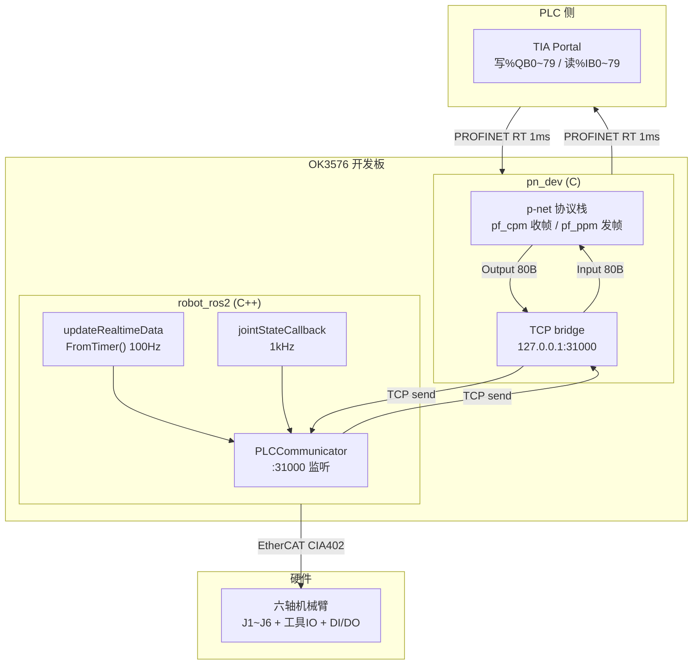

# 系统架构总览

```mermaid
graph TB
    subgraph PLC["PLC 侧"]
        TIA["TIA Portal<br/>写%QB0~79 / 读%IB0~79"]
    end

    subgraph OK3576["OK3576 开发板"]
        subgraph pn_dev["pn_dev (C)"]
            pnet["p-net 协议栈<br/>pf_cpm 收帧 / pf_ppm 发帧"]
            bridge["TCP bridge<br/>127.0.0.1:31000"]
        end

        subgraph robot["robot_ros2 (C++)"]
            plc_comm["PLCCommunicator<br/>:31000 监听"]
            timer["updateRealtimeData<br/>FromTimer() 100Hz"]
            jsc["jointStateCallback<br/>1kHz"]
            timer --> plc_comm
            jsc --> plc_comm
        end
    end

    subgraph hardware["硬件"]
        arm["六轴机械臂<br/>J1~J6 + 工具IO + DI/DO"]
    end

    PLC -->|"PROFINET RT 1ms"| pn_dev
    pnet -->|"Output 80B"| bridge
    bridge -->|"TCP send"| plc_comm
    plc_comm -->|"TCP send"| bridge
    bridge -->|"Input 80B"| pnet
    pn_dev -->|"PROFINET RT 1ms"| PLC
    robot -->|"EtherCAT CIA402"| arm
```
