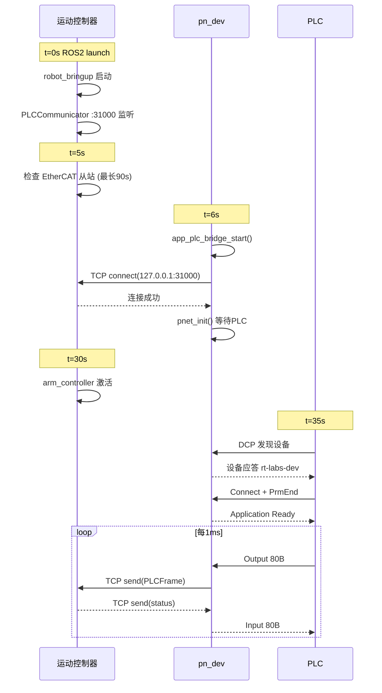

# 启动与运行时序

```mermaid
sequenceDiagram
    participant Robot as 运动控制器
    participant pn_dev
    participant PLC

    Note over Robot: t=0s ROS2 launch
    Robot->>Robot: robot_bringup 启动
    Robot->>Robot: PLCCommunicator :31000 监听

    Note over Robot: t=5s
    Robot->>Robot: 检查 EtherCAT 从站 (最长90s)

    Note over pn_dev: t=6s
    pn_dev->>pn_dev: app_plc_bridge_start()
    pn_dev->>Robot: TCP connect(127.0.0.1:31000)
    Robot-->>pn_dev: 连接成功

    pn_dev->>pn_dev: pnet_init() 等待PLC

    Note over Robot: t=30s
    Robot->>Robot: arm_controller 激活

    Note over PLC: t=35s
    PLC->>pn_dev: DCP 发现设备
    pn_dev-->>PLC: 设备应答 rt-labs-dev
    PLC->>pn_dev: Connect + PrmEnd
    pn_dev-->>PLC: Application Ready

    loop 每1ms
        PLC->>pn_dev: Output 80B
        pn_dev->>Robot: TCP send(PLCFrame)
        Robot-->>pn_dev: TCP send(status)
        pn_dev-->>PLC: Input 80B
    end
```
