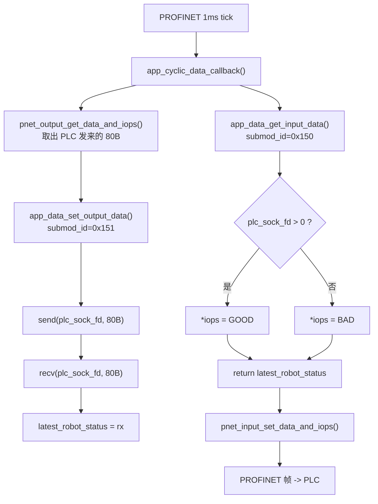

# app_data.c 内部数据流

```mermaid
flowchart TD
    tick["PROFINET 1ms tick"]
    tick --> cdc["app_cyclic_data_callback()"]
    cdc --> gdo["pnet_output_get_data_and_iops()<br/>取出 PLC 发来的 80B"]
    cdc --> gdi["app_data_get_input_data()<br/>submod_id=0x150"]

    gdo --> asdo["app_data_set_output_data()<br/>submod_id=0x151"]
    asdo --> send["send(plc_sock_fd, 80B)"]
    send --> recv["recv(plc_sock_fd, 80B)"]
    recv --> cache["latest_robot_status = rx"]

    gdi --> check{"plc_sock_fd > 0 ?"}
    check -->|"是"| good["*iops = GOOD"]
    check -->|"否"| bad["*iops = BAD"]
    good --> ret["return latest_robot_status"]
    bad --> ret
    ret --> psi["pnet_input_set_data_and_iops()"]
    psi --> frame["PROFINET 帧 -> PLC"]
```
