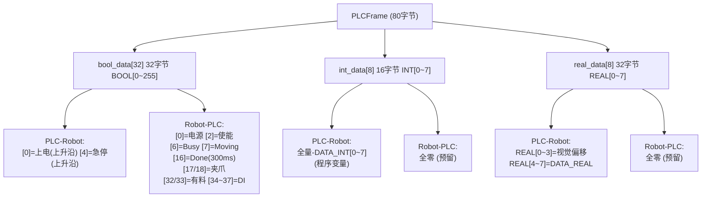

# PLCFrame 协议 (80字节)

```mermaid
graph TB
    plc["PLCFrame (80字节)"]

    plc --> bool_grp["bool_data[32] 32字节 BOOL[0~255]"]
    plc --> int_grp["int_data[8] 16字节 INT[0~7]"]
    plc --> real_grp["real_data[8] 32字节 REAL[0~7]"]

    bool_grp --> bool_plc["PLC-Robot:<br/>[0]=上电(上升沿) [4]=急停(上升沿)"]
    bool_grp --> bool_robot["Robot-PLC:<br/>[0]=电源 [2]=使能<br/>[6]=Busy [7]=Moving<br/>[16]=Done(300ms)<br/>[17/18]=夹爪<br/>[32/33]=有料 [34~37]=DI"]

    int_grp --> int_plc["PLC-Robot:<br/>全量-DATA_INT[0~7]<br/>(程序变量)"]
    int_grp --> int_robot["Robot-PLC:<br/>全零 (预留)"]

    real_grp --> real_plc["PLC-Robot:<br/>REAL[0~3]=视觉偏移<br/>REAL[4~7]=DATA_REAL"]
    real_grp --> real_robot["Robot-PLC:<br/>全零 (预留)"]
```
