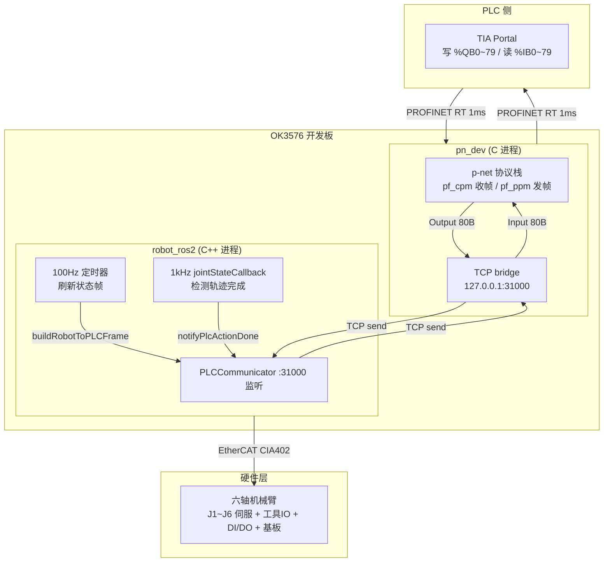
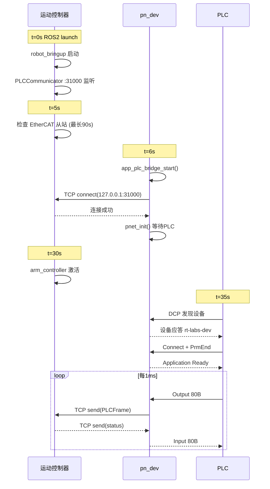
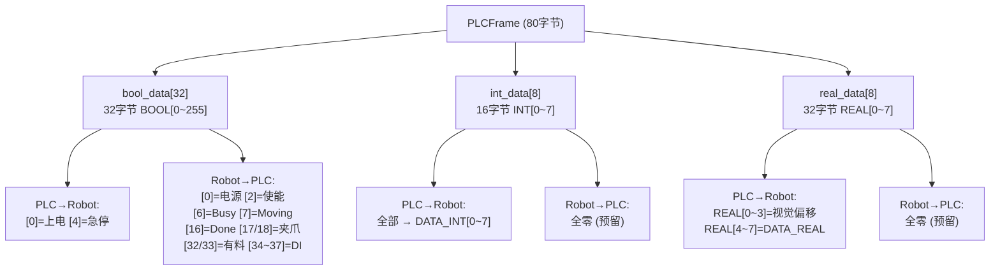
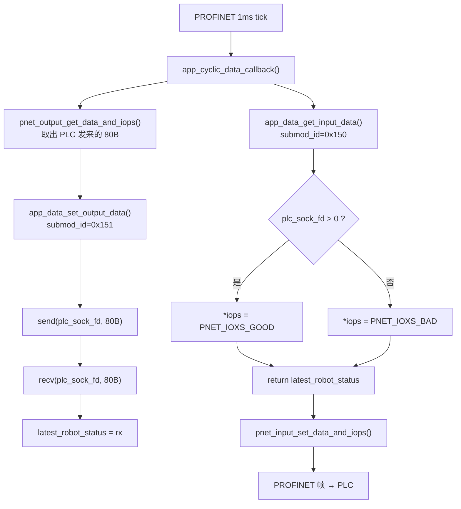

# PROFINET 六轴机械臂控制系统 — 架构文档

> [!abstract] 一句话概述
> PLC 通过 PROFINET 网线直连 OK3576 开发板上的 pn_dev，pn_dev 通过 TCP localhost 将 80 字节 PLCFrame 透传给同板上的 ROS2 运动控制器，运动控制器通过 EtherCAT 控制六轴机械臂。

---

## 系统架构总览



### 数据流缩略图

```
PLC ──PROFINET(80B)──→ pn_dev ──TCP:31000(80B)──→ robot_ros2 ──EtherCAT──→ 机械臂
PLC ←──PROFINET(80B)── pn_dev ←──TCP:31000(80B)── robot_ros2 ←──EtherCAT── 机械臂
```

> [!info] 关键设计
> pn_dev **不解析数据内容**，只做透传。80 字节 PLCFrame 原样在 PROFINET 和 TCP 之间转发。
> 运动控制器的 PLCCommunicator **代码不用改**，pn_dev 替代了原来 PLC 的 TCP 直连。

---

## 启动与运行时序



> [!tip] 启动顺序
> 推荐先启动运动控制器，再启动 pn_dev。pn_dev 自带 TCP 重连，即使反过来也能自动恢复。

<details>
<summary><b>开机自启脚本 start_all.sh</b></summary>

```bash
#!/bin/bash
# 部署在 /home/default/start_all.sh

# 1. 启运动控制器
source /opt/ros/humble/setup.bash
source /home/default/robot_software_control/install/local_setup.bash
export ROBOT_TYPE=w5_c
ros2 launch robot_moveit_config robot_complete.launch.py &

# 2. 等 PLC 端口就绪
for i in $(seq 1 60); do
    ss -tln | grep -q 31000 && break
    sleep 1
done

# 3. 启 pn_dev
cd /home/default/profinet
sudo ./kill_pn_dev.sh 2>/dev/null
sudo ./pn_dev -i eth0 -s rt-labs-dev -p /tmp/pnet &
echo "=== 系统启动完成 ==="
```

</details>

---

## PLCFrame 协议 (80字节)



### PLC → Robot 信号

| 地址 | 信号 | 触发 | 功能 |
|------|------|------|------|
| `%QB0.0` | BOOL[0] | **上升沿** | 上电启动 |
| `%QB0.4` | BOOL[4] | **上升沿** | 软急停 |
| `%QD48~60` | REAL[0~3] | 连续 | 视觉偏移 X/Y/Z/R |
| `%QB0~31` | BOOL[0~255] | 连续 | 程序变量 `DATA_BOOL[N]` |
| `%QW32~46` | INT[0~7] | 连续 | 程序变量 `DATA_INT[N]` |
| `%QD48~76` | REAL[0~7] | 连续 | 程序变量 `DATA_REAL[N]` |

### Robot → PLC 信号

| 地址 | 信号 | 代码来源 | 说明 |
|------|------|---------|------|
| `%IB0.0` | BOOL[0] | `gpio_safety_get_state()` | 电源已上电 |
| `%IB0.1` | BOOL[1] | `EnableStatus==0` | 告警 |
| `%IB0.2` | BOOL[2] | `EnableStatus!=0` | 已使能 |
| `%IB0.6` | BOOL[6] | `trajectory_cache_.is_active` | 轨迹执行中 |
| `%IB0.7` | BOOL[7] | `sum|qd| > 0.005` | 关节运动中 |
| `%IB1.7` | BOOL[15] | `sum|qd| > 0.005` | Action Busy |
| `%IB2.0` | BOOL[16] | `done_expire` 保持 300ms | **Action Done** |
| `%IB2.1~2` | BOOL[17~18] | `AI0/AI1 > 128` | 夹爪闭合 |
| `%IB4.0~1` | BOOL[32~33] | `tool DI bit0/1` | 夹爪有料 |
| `%IB4.2~5` | BOOL[34~37] | `board DI bit0~3` | 板载传感器 |
| `%IW32~46` | INT[0~7] | 未使用 | 全零 |
| `%ID48~76` | REAL[0~7] | 未使用 | 全零 |

> [!important] 沿触发 vs 电平
> **BOOL[0] 和 BOOL[4] 是上升沿触发**，不是电平触发。操作后必须复位为 0，下次才能再次触发。
> **BOOL[16] 仅保持 300ms**，PLC 侧应检测上升沿后立即锁存。

---

## pn_dev 内部数据流



### 核心回调

| 函数 | 方向 | 频率 | 说明 |
|------|------|------|------|
| `app_data_set_output_data()` | PLC → Robot | ~1ms | send + recv TCP 对 |
| `app_data_get_input_data()` | Robot → PLC | ~1ms | 返回缓存的状态帧 |
| `plc_tcp_thread_fn()` | 连接管理 | 后台线程 | 自动连接/重连 |

### IOPS 状态

| 值 | 含义 | 触发 |
|----|------|------|
| `PNET_IOXS_GOOD` | 数据有效 | `plc_sock_fd > 0` (运动控制器已连接) |
| `PNET_IOXS_BAD` | 数据无效 | `plc_sock_fd = -1` (TCP 断开) |

---

## 部署到 OK3576

### 开发板目录布局

```
/home/default/
├── start_all.sh                      # 总启动脚本
├── profinet/
│   ├── pn_dev                        # PROFINET 从站程序
│   ├── GSDML-V2.43-*.xml             # 设备描述文件
│   └── kill_pn_dev.sh                # 进程清理
├── robot_software_control/
│   └── install/                      # ROS2 交叉编译产物
└── config/
    └── param.json                    # 运动控制器配置
```

### 部署命令

```bash
# 交叉编译 pn_dev（x86 主机 → aarch64）
cd ~/profinet/p-net-1.0.2-samples
rm -rf build && mkdir build && cd build
cmake .. -DCMAKE_TOOLCHAIN_FILE=../cmake/aarch64-linux-gnu.cmake
make -j$(nproc)

# 上传到开发板
sshpass -p 'default' scp build/pn_dev/pn_dev default@192.168.1.100:/home/default/profinet/
sshpass -p 'default' scp ../pn_dev/GSDML*.xml default@192.168.1.100:/home/default/profinet/
sshpass -p 'default' scp ../kill_pn_dev.sh default@192.168.1.100:/home/default/profinet/

# 在开发板上启动
sshpass -p 'default' ssh default@192.168.1.100
cd /home/default && ./start_all.sh
```

---

## 当前修改状态

### pn_dev 侧

> [!success] 已完成 7/7

| 文件 | 改动 | 状态 |
|------|------|------|
| `app_gsdml.h` | +6行 新增 PLCFrame 常量 | ✅ |
| `app_gsdml.c` | +32行 注册模块到目录 | ✅ |
| `app_data.c` | +140行 TCP 客户端 + 透传 | ✅ |
| `app_data.h` | +11行 函数声明 | ✅ |
| `sampleapp_main.c` | +1行 启动 TCP 桥 | ✅ |
| `GSDML XML` | +38行 模块定义 | ✅ |
| `CMakeLists.txt` | 无需修改 (pthread已链接) | ✅ |
| **编译** | **通过，零错误零警告** | ✅ |

### robot_ros2 侧

> [!success] 已完成 2/2

| 文件 | 改动 | 状态 |
|------|------|------|
| `robot_ros2.cpp` L778 | +6行 刷新 PLC 状态帧 | ✅ |
| `robot_ros2.cpp` L828 | +1行 通知轨迹完成 | ✅ |
| **编译** | **待验证** | ⬜ |

### PLC 侧

> [!warning] 待执行

| 步骤 | 说明 |
|------|------|
| 导入 GSDML | 含 IDM_50 (PLC Frame) 模块 |
| 配置 Slot 1 | PLC Frame 模块 (80字节 In + 80字节 Out) |
| PLC 程序 | %Q/%I 区替代原来 TCP 通信 |

---

## 文档导航

| 文档 | 受众 |
|------|------|
| [[PLC接口对接文档]] | PLC 程序员 |
| [[修改计划]] | pn_dev 开发者 |
| [[机器人控制器修改计划]] | robot_ros2 开发者 |
| [[系统架构图]] | ASCII 架构图 (终端查看) |

---

*更新于 2026-06-17*
